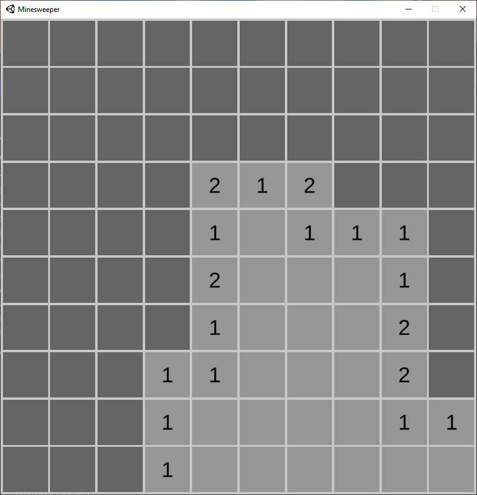

# Minesweeper
Minesweeper client made in Unity (2020.3.29f1). Pixel art made using Krita.

## Controls
- Left-click to reveal a square
- Right-click to mark/unmark a square with a flag

## Screenshots
\
\

